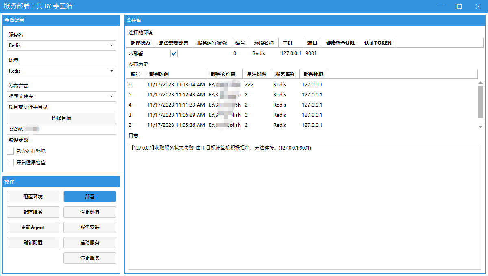
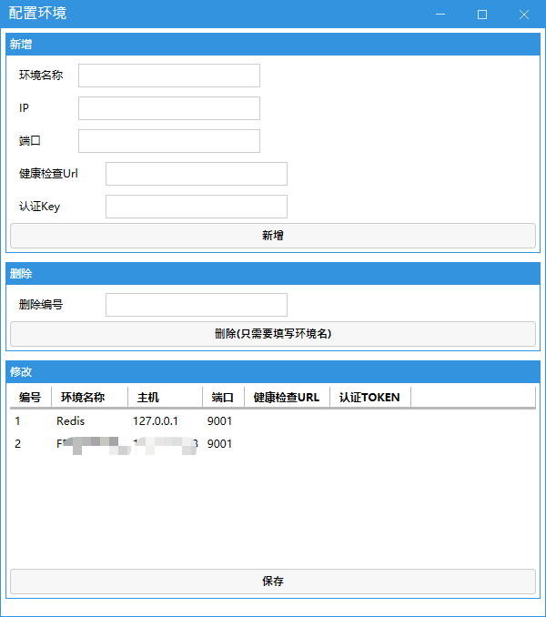
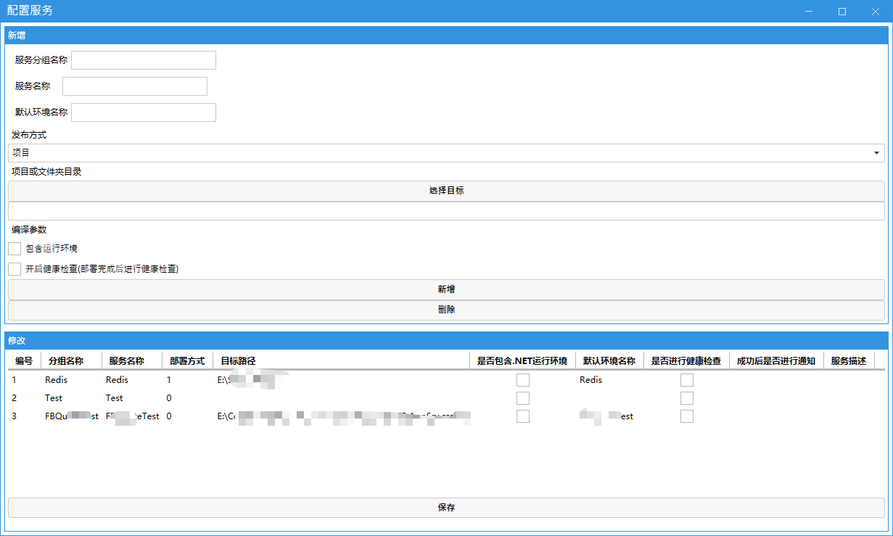
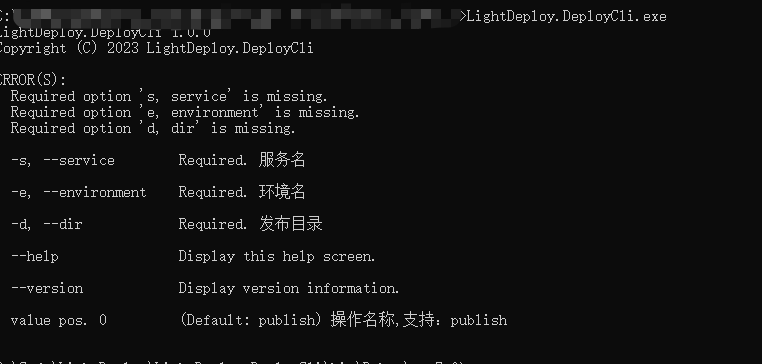

# LightDeploy

.NET应用部署工具(目前只支持Windows服务部署)

1. 支持CLI工具，方便和Jenkins集成
2. 支持支持增量更新(对比文件日期/MD5)
3. 支持多服务器批量发布
4. 支持企业微信通知
5. 支持发布后健康检查
6. 支持安装、启动、停止Windows服务
7. 支持权限认证
8. 支持失败自动回滚

# 页面

主要界面：

环境配置：

服务配置：

CLI工具：

# 使用方式

1. 下载软件

https://github.com/li-zheng-hao/LightDeploy/releases/tag/v1.0.0

一共两个文件，`LightDeployApp.rar`是桌面客户端，`LightDeployAgentService.rar`是服务端代理

2. 安装服务端代理

复制`LightDeployAgentService.rar`到服务安装的服务器上解压,运行`install_service.bat`脚本安装Windows服务,检查服务是否正常运行,默认端口9001，未开启权限认证

3. 客户端配置

> 数据存储在`lightdeploydata.sqlite`文件中，不想用界面配置可以直接用navicat等工具修改数据库

例如要部署一个App.exe程序到服务器上,服务名为AppService，首先配置环境：

1. 环境名称：建议和服务名一致，AppService
2. IP：服务器IP
3. 端口：默认9001
4. 健康检查url：如果自己的api服务有健康检查接口，可以填写，如果没有，可以填写，如 http://localhost:9001/health ,开启后30秒内请求返回200则通过
5. 认证Key：服务端文件夹下的`appsettings.json`配置文件中 "AuthKey":"" 用于配置key，不填不开启

然后配置服务：

1. 服务分组：用于区分不同服务，例如AppServiceTest，AppServiceProduction服务都属于AppService服务组
2. 服务名称：AppService，也就是发布到服务器上的Windows服务名
3. 默认环境名称：上一步填写的环境名
4. 发布方式：目录的话，填写目录，例如D:\AppService，如果是项目，则选择.csproj项目文件,部署自动执行dotnet publish命令打包（只支持dotnet core）
5. 是否包含运行环境：dotnet publish命令添加参数  --self-contained包含运行环境
6. 是否健康检查：部署完成后，定时请求填写的接口，如果30秒内返回200，则认为健康

> 环境即一个服务器,一个服务支持多个环境，也就是一个服务可以同时发布到多个服务器上

4. 部署

点击部署按钮即可开始部署，按步骤依次填写发布备注或通知等即可
